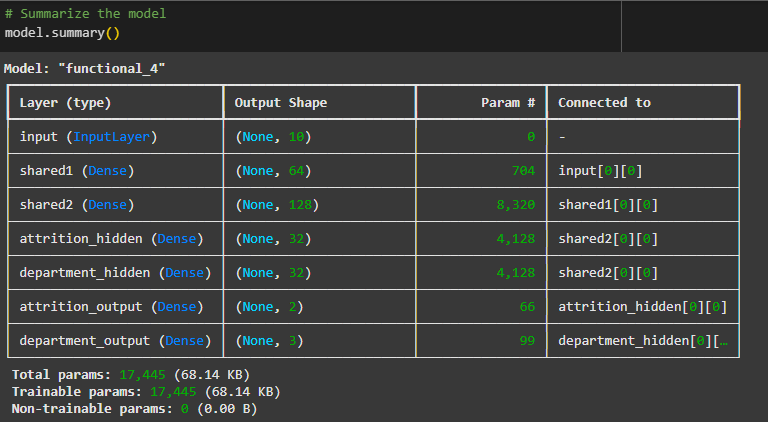

# neural-network-challenge-2
Module 19 Challenge - HR Attrition and Best Fit Department Prediction

## Introduction
HR wants to find out about possible attrition of employees and their best suited department.  The task is to implement a branched neural network model using the TensorFlow library and scikit-learn library.  

## Data source
HR has provided the original dataset with as 27 columns in a csv file.  
[HR Attrition](https://static.bc-edx.com/ai/ail-v-1-0/m19/lms/datasets/attrition.csv)

## Steps
**Step 1 - Preprocessing**
- Import the HR attrition file
- The `Attrition` and `Department` are determined to be label data
- Examine the columns to select a set of 10 as features
- Split the data into training and testing sets
- Encode categorical features
- Use StandardScaler to scale the feature columns
- Use OneHotEncoder to encode the labels, Attritiona and Department

**Step 2 - Implement and Train a Branched Neural Network**
- Using the functional approach of TensorFlow, create an input layer based on the shape of the training data
- Create 2 shared layers
- Create a branch for the Department with 1 hidden layer and 1 outout layer
- Create a branch for the Attrition with 1 hidden layer and 1 output layer
- Define the TensorFlow model with the input layer and output layers
- Compile the model with loss functions and metrics
- Review the model summary, and fit the model with training data

- Evaluate the model with testing data

**Step 3 - Summary Discustion
- Discuss if accuray is the best metric to use on this data
- Explain the choice of activation functions for the output layers
- Sugguest a few ways to improve the model